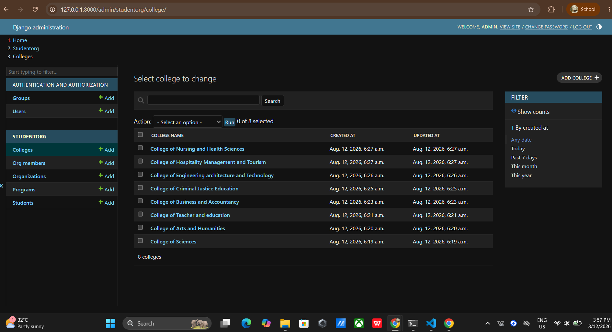

# PSUSphere

## Project Description

PSUSphere is a Django-based web application for managing colleges, academic programs, students, student organizations, and organization memberships.

## Features

- Manage colleges
- Manage academic programs
- Manage student organizations
- Manage student information
- Manage organization memberships
- Django Admin interface
- Search and filter records in Django Admin
- Generate initial data using Faker

## Authors

- Chars Gerand Almocera
- Ariel john Cordovez